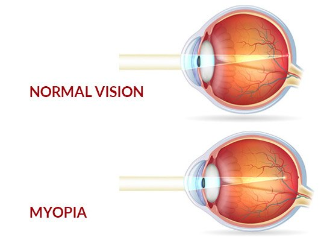
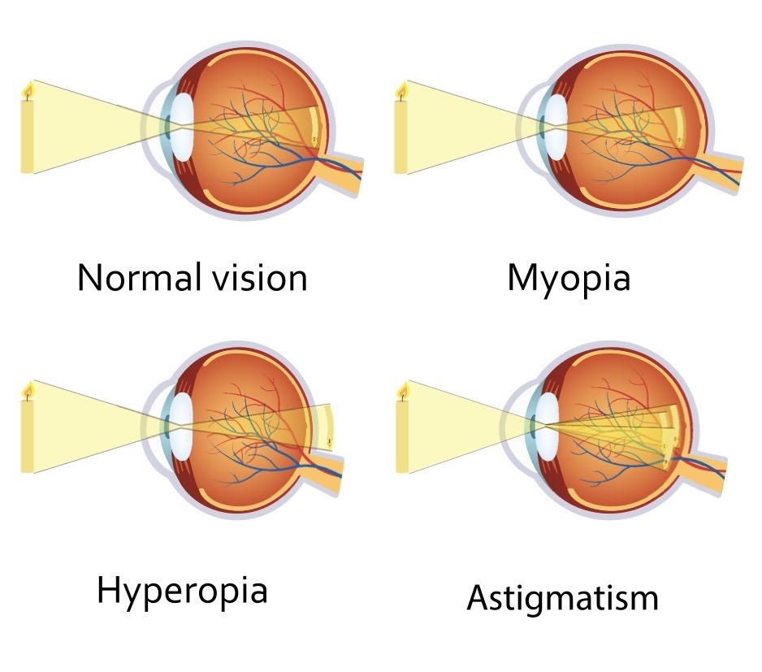

# Simulation of a dataset using Python
## Elizabeth Daly

### HDip Data Analytics 2019 Programming for Data Analysis Project

- Git-hub repository at: https://github.com/elizabethdaly/simulating-data.git

- Jupyter notebook: **eyesight.ipynb**

# Table of contents
1. [Introduction](#intro)

2. [Myopia](#section2)

3. [blah 3 ](#section3)

4. [blah 4](section4)
    
5. [blah 5](#section5)
    
6. [blah 6](#section6)
    
7. [Conclusions](#conclusions)

8. [References](#references)

## 1. Information 
- This README describes work done for the Programming for Data Analysis module project, due 13 December 2019. 
- Resources used include Python and associated packages Jupyter, matplotlib, and NumPy. 
- The analysis takes the form of a single Jupyter notebook of filename given above. To view this file, download it from this repository and start Jupyter notebook from the folder containing the file. Jupyter notebook comes as part of the Anaconda distribution of Python (as do the other packages listed above). 
- Alternatively, view a static version of the notebook (by providing its GitHub url) using Jupyter Nbviewer.
- All images intended for inclusion in this README are located in the **images** subdirectory of this repository.
- I would like for this README to complement the analyses performed in the notebook rather than just repeat what's done there.

## 2. Myopia 

Edit: The question I want to address with this project is: What are the factors that affect the distribution of short-sightedness (myopia) in a random sample of the population?

### What is myopia?
Myopia is also referred to as short-sightedness or near-sightedness. I will stick to using the term myopia as it saves a bit of typing. It happens mainly because the eyeball grows too long so that distant objects appear blurry while only very close objects are sharp. It happens because light entering the eye comes to a focus in front of (rather than on) the back of the eye - the retina. This means that the clearest image of the object is formed in front of the retina rather than on it, where our brain records images. It is a refractive error of the eye: as light travels through the eye it is bent (refracted) and absorbed by the different structures it passes through, primarily the cornea and the lens. The cornea is the front surface of the eye and the lens is a transparent element behind the iris that helps to bring light to a focus. If the end result is that the light from an object comes to a focus away from the retina, then that person has a refractive error. In myopia light from distant objects comes to a focus in front of the retina.

<!---->

 
    
 

There are other common refractive errors apart from myopia. These include hyperopia (light comes to a focus behind the retina) and astigmatism (light along the horizontal and vertical axes comes to a focus at different points). A person with normal vision is emmetropic or, an emmetrope. These different situations are illustrated below.

<!---->

 
    
 

Myopia, hyperopia, and astigmatism are easily corrected by optometrists who prescribe glasses or contact lenses of the correct power. In recent decades laser eye surgery has also become very popular as a way to permanently correct these refractive errors for suitable candidates. It does so by re-shaping the surface of the cornea, changing its shape, and therefore changing how light is refracted as it travels through the front of the eye. On the surface it seems like an attractive option, but it is permanent and not without its own risks.

### How is it quantified/corrected?
All refractive errors are measured in units called Dioptres (D), which is the reciprocal of focal length f measured in metres: D = 1/f(m). For example, 1 D = 1/(f=1m), 2 D = 1/(f=0.5m), 3 D = 1/(f=0.33m) and so on. So a 5 D lens would focus light at 1/5 = 0.2 m. The amount of myopia is quantified by the power of the lens required to correct it (move the best focus back onto the retina). Negative values are needed to correct myopia so a sort-sighted person might have a prescription of -2 D perhaps. Conversely, a person with hyperopia (far-sighted) will have a positive prescription. For a person with normal vision, the combined power of the lens and cornea is 60 D (meaning the human eye focal length is approximately 17 mm). The severity of myopia is quantified as follow:

| Degree    | Amount (D)    |
| :---------|:-------------:|
| Low       | 0 to -3       |
| Moderate  | -3 to -6      |
| High      | more than -6  |

Lenses used for myopia correction usually come in 0.25 D steps - the closest one to a patients prescription is used. The image below shows how a negative (concave) lens is used to correct myopia.

 
    
 

### Why this question?
I'm interested in this question on a personal level because my teenage daughter has myopia. She started wearing glasses when she was nine years old, and every year her prescription went up a little, as expected. However, when she was 14 years old her eyesight deteriorated and her prescription almost doubled in just 10 months. By that stage she had the same prescription as her dad. Myopia progresses as you (and your eyeballs) grow, so if she continued on this track her optometrist speculated that she could end up at 5 or 6 dioptres by the time she had finished growing. She is now wearing myopia correcting contact lenses for six days out of every seven, in an attempt to slow her myopia progression. These lenses have a central pupil which provides correction in the same way as ordinary contact lenses do. However, they also have a peripheral ring on the outside edge of the lens, where the correction is lower so that light from this part of the lens comes to a focus in front of the retina. Somehow, (I haven't been able to find the exact detail of how they work), this discourages growth of the eyeball and therefore slows myopia progression. They appear to be working - fingers crossed.

### Aim: 
to produce an image like: find histogram of frequency vs refractive error.
Risk factors for myopia. Possible variables.

## 3. Causes of myopia 

## 4. Variables 
    - Refractive error D
    - Genes
    - Close work
    - Social class
    - Environmental
    - Age

## 5. blah 5 
## 6. blah 6 
## 7. Conclusions 
## 8. References 

**General:**

- [1]  Anaconda Distribution
https://www.anaconda.com/
- [2] Python Software Foundation
https://www.python.org/
- [3] Project Jupyter
https://jupyter.org/
- [4] Sharing Jupyter notebooks
https://nbviewer.jupyter.org/
- [5] matplotlib: Python plotting library
htts://matplotlib.org/
- [6] NumPy
https://numpy.org/
- [7] GitHub
https://github.com/
- [8] Python for Data Analysis: Data Wrangling with Pandas, NumPy, and IPython. 
Wes McKinney. ISBN-13: 978-1491957660 ISBN-10: 1491957662
- [9] Random sampling (numpy.random)
https://docs.scipy.org/doc/numpy-1.16.0/reference/routines.random.html

**Myopia**

- [] WIKIPEDIA: Near-sightedness
https://en.wikipedia.org/wiki/Near-sightedness

- [] American Academy of Ophthalmology: Global Prevalence of Myopia and High Myopia and Temporal Trends from 2000 through 2050
https://www.aaojournal.org/article/S0161-6420(16)00025-7/abstract

- [] All about vision: What is myopia?
https://www.allaboutvision.com/conditions/myopia-faq/what-is-myopia.htm

- [] VISION EXCELLENCE: Myopia (short-sightedness)
https://www.visionexcellence.com.au/common-eye-conditions/myopia-short-sightedness/

- [] Cooper Vision: MiSight 1 day lenses
https://coopervision.co.uk/contact-lenses/misight-1-day