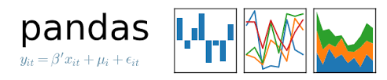

# Simulation of a dataset relating to eyesight
# 52465 Programming for Data Analysis

<!--  -->

<p align="middle">
  
  
   
  
</p>

## Project description

This README describes work done for the Programming for Data Analysis module project, due 16 December 2019.

We have been asked to simulate a real-world phenomenon of our own choosing. Our task is to model and synthesize data relating to this phenomenon using Python, in particular the numpy.random package. The end product of this project should be a synthesized data set. I will examine the phenomenon of eyesight, specifically short-sightedness (also referred to as myopia). I wish to create a data set of variables associated with myopia. I would like to simulate the distribution of short-sightedness (myopia) in a random sample of the population. I also explore the relationships, if any, between factors which seem to contribute to myopia.

## Getting started

These instructions will get you a copy of the project up and running on your local machine for development and testing purposes.

### Prerequisites
- [Anaconda distribution of Python](https://www.anaconda.com/distribution/)
- [Python Software Foundation](https://www.python.org/)
- [Project Jupyter](https://jupyter.org/)
- [matplotlib: Python plotting library](https://matplotlib.org/)
- [NumPy](https://numpy.org/)
- [SciPy](https://www.scipy.org/)
- [Pandas](https://pandas.pydata.org/)

### Installing
Download and install the Anaconda distribution of Python from the link above. The other packages (Jupyter notebook, Pandas, matplotlib, NumPy, and SciPy) come as part of that distribution.

### Project repository
This project is hosted on [GitHub](https://github.com/) at 
https://github.com/elizabethdaly/simulating-data.git

The analysis takes the form of a single Jupyter notebook of filename **eyesight.ipynb**

### Instructions for cloning the repository
A repository on GitHub exists as a remote repository. You can clone this repository to create a local copy on your computer by following these instructions:
1. On GitHub, navigate to the main page of the repository https://github.com/elizabethdaly/simulating-data.git
2. Under the repository name, click Clone or download.
3. Choose "Clone with HTTPS".
4. Open a terminal on your machine. Change the current working directory to the location where you want the cloned directory to be made.
5. Type git clone, and then paste the URL you copied in 2 above.
```
git clone https://github.com/elizabethdaly/simulating-data.git
```
6. Press enter to clone the repository to your machine.

## Static version of the notebook
Alternatively, one can view a static version of the notebook using [Jupyter Nbviewer](https://nbviewer.jupyter.org/). Enter the GitHub url to view the file.

```
https://github.com/elizabethdaly/simulating-data/blob/master/eyesight.ipynb
```

## Additional files
- All images intended for inclusion in this README or the Jupyter notebook are located in the **images** subdirectory of this repository.
- Additional data files to be read into the notebook are located in the **data** subdirectory of this repository.

## Author
Elizabeth Daly for HDip in Data Analytics 2019/2020.

## Licence

This project is licensed under the GNU General Public License v3.0 - see the LICENSE.md file for details.